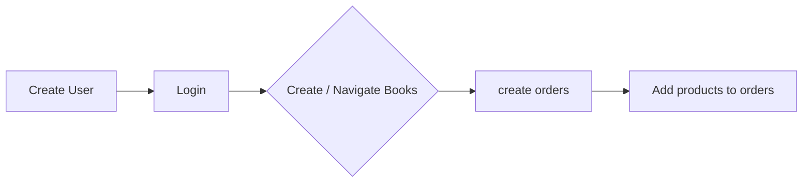

# About
 - Name :Kyrillos Maher Fekry
 - Project name : Storefront backend
 - version: 1
## Description
A backend project for books store.
It is a backend used to create users into the database to allow them to create books, and orders , as well as adding products to their order.

# Setup the Project
**First of all you need to use `npm install` or `yarn install` to add all dependencies.**
the developer should open **psql** and follow the next instructions.
1. create user with password. to connect to database
```sh
CREATE USER postgres WITH PASSWORD '1234';
```

2. The user should create a database called `postgres` 
**For development**
```sh
CREATE DATABASE postgres;
```

3. and Create `postgres_test` 
**For testing.**
```sh
CREATE DATABASE postgres_test;
```

4. grant all access abilities to user for `dev database` and `test database`
```sh
GRANT ALL PRIVILEGES ON DATABASE postgres TO postgres;
```
```sh
GRANT ALL PRIVILEGES ON DATABASE postgres_test TO postgres;
```
5. needed dependencies
## Dependencies
```json
{
	"@types/typescript": "^2.0.0",
	"bcrypt": "^5.0.1",
	"cors": "^2.8.5",
	"db-migrate": "^0.11.13",
	"db-migrate-pg": "^1.2.2",
	"dotenv": "^16.0.0",
	"express": "^4.17.3",
	"jasmine-spec-reporter": "^7.0.0",
	"jasmine-ts": "^0.4.0",
	"jsonwebtoken": "^8.5.1",
	"pepper": "^0.1.0",
	"pg": "^8.7.3",
	"salt": "^0.5.5",
	"supertest": "^6.2.2",
	"ts-node": "^10.7.0"
}
```
## Dev Dependencies
```json
{
    "@types/bcrypt": "^5.0.0",
    "@types/cors": "^2.8.12",
    "@types/express": "^4.17.13",
    "@types/jasmine": "^4.0.3",
    "@types/jsonwebtoken": "^8.5.8",
    "@types/node": "^17.0.24",
    "@types/pg": "^8.6.5",
    "@types/supertest": "^2.0.12",
    "@typescript-eslint/eslint-plugin": "^5.19.0",
    "@typescript-eslint/parser": "^5.23.0",
    "eslint": "^8.13.0",
    "eslint-config-airbnb-base": "^15.0.0",
    "eslint-plugin-import": "^2.25.4",
    "jasmine": "^4.1.0",
    "nodemon": "^2.0.16",
    "prettier": "^2.6.2",
    "typescript": "^4.6.4"
  }
```
6 - create a .env file in the main directory with all the following variables 
## 	ENV variables 
```ENV
# App environment [dev|test]

ENV=test

PORT=3000

TESTING=false

# Database

POSTGRES_HOST=127.0.0.1
DB_PORT=5432

POSTGRES_DB=postgres
DB_TEST_NAME=postgres_test
POSTGRES_USER=postgres
POSTGRES_PASSWORD=3011

#JWT ENV variables

BCRYPT_PASSWORD=EGOsum13ALPHA0oMEGA
SALT_ROUNDS=10
TOKEN_SECRET=venideivivi33011
BCRYPT_PEPPER=12asdwww
JWT_EXPIRATION=1h
```

## scripts used
```json 
{
    "jasmine": "jasmine",
    "test": "db-migrate up -e test -c 100 && yarn build && jasmine && db-migrate down -e test -c 100",
    "start": "nodemon \"./src/app.ts\"",
    "lint": "eslint ./**/*.ts --fix",
    "build": "npx tsc",
    "prettier": "prettier --config .prettierrc \"./src/app.ts\" --write"
  }
```

## How to use the API

1. install dependencies using `yarn install` or `npm install`.
2. type `yarn start` to start the server
3. Create a user using the user route provided in details at `Requirements.md`
4. Login using the credentials you used to create user and keep the token provided to you for any route that needs verifying.
5.  check the books route ( all routes provided in  `Requirements.md`) 
6. Create order using order routes  ( provided in  `Requirements.md`) 
7. now you can add product/s to your order using book orders route  ( provided in  `Requirements.md`) .
8. after adding a product you can use the get method with verification token to get all orders the verified user has made.

# Project Structure


## Main directories and files
```bash
├── README.md
├── REQUIREMENTS.md
├── build
├── database.json
├── lib
│   └── jasmine_examples
│       ├── Player.js
│       └── Song.js
├── migrations
│   └── sqls
├── package-lock.json
├── package.json
├── spec
│   └── support
│       └── jasmine.json
├── src
│   ├── app.ts
│   ├── config: `It has all db configurations , auth and main app config`
│   │   ├── app.config.ts
│   │   ├── auth.ts
│   │   ├── database.config.ts
│   │   └── index.ts
│   ├── handlers
│   │   ├── books.ts
│   │   ├── order_handler.ts
│   │   └── user_handler.ts
│   ├── models
│   │   ├── book_product.ts
│   │   ├── order.ts
│   │   ├── order_book.ts
│   │   └── user.ts
│   └── spec
│       ├── booksSpec.ts
│       ├── helpers
│       │   └── reporter.ts
│       ├── networkSpec.ts
│       ├── orderSpec.ts
│       ├── order_bookSpec.ts
│       └── userSpec.ts
├── tsconfig.json
├── yarn-error.log
└── yarn.lock
```


## diagrams


